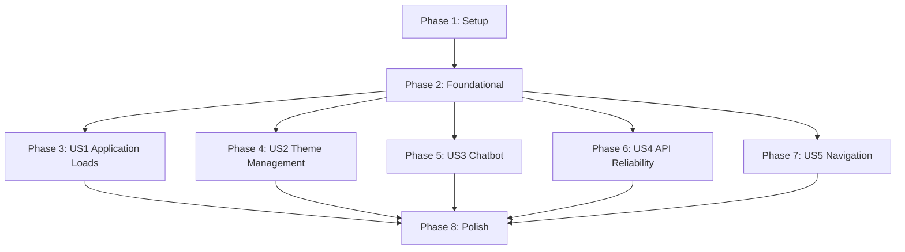

# Implementation Tasks: Phase III Stability + Chatbot Integration Fix

**Feature**: 001-fix-hydration-stability
**Branch**: `001-fix-hydration-stability`
**Created**: 2026-02-08
**Spec**: [spec.md](spec.md) | **Plan**: [plan.md](plan.md)

---

## Implementation Strategy

**MVP Scope**: User Story 1 (Application Loads Without Errors) - Critical foundation for all other features

**Incremental Delivery**:
1. US1 (P1): Application loads cleanly → Deploy & validate
2. US2 (P1): Theme management works → Deploy & validate
3. US3 (P1): Chatbot functional → Deploy & validate
4. US4 (P2): API reliability confirmed → Deploy & validate
5. US5 (P2): Navigation polished → Final deployment

**Parallel Execution**: Most tasks within each user story can run in parallel (marked with [P])

**Status**: ✅ Core fixes implemented | ⏳ Validation in progress

---

## Task Summary

| Phase | User Story | Task Count | Status |
|-------|------------|------------|--------|
| 1 | Setup | 3 | ✅ Complete |
| 2 | Foundational | 10 | ✅ Complete |
| 3 | US1: Application Loads | 5 | ⏳ Validation (0/5 manual tests) |
| 4 | US2: Theme Management | 4 | ⏳ Validation (0/4 manual tests) |
| 5 | US3: Chatbot Messaging | 5 | ✅ Code Review Complete (4/5 manual tests remain) |
| 6 | US4: API Reliability | 4 | ⏳ Validation (0/4 manual tests) |
| 7 | US5: Navigation & UI | 4 | ✅ Code Review Complete (3/4 manual tests remain) |
| 8 | Polish & Verification | 7 | 🔄 Pending |
| **Total** | - | **42** | **15 ✅ / 20 ⏳ / 7 🔄** |

---

## Phase 1: Setup (✅ COMPLETE)

**Goal**: Initialize project with correct configuration for hydration-safe development

**Status**: All setup tasks completed during initial fix implementation

### Tasks

- [x] T001 Verify Next.js 16.1.2 installation in frontend/package.json
- [x] T002 Configure TypeScript with strict: false in frontend/tsconfig.json
- [x] T003 Verify development server runs without errors: `cd frontend && npm run dev`

**Validation**: ✅ Build succeeds, dev server running at http://localhost:3000

---

## Phase 2: Foundational (✅ COMPLETE)

**Goal**: Implement core hydration-safe patterns in shared infrastructure

**Status**: All foundational fixes implemented and build passing

### Tasks

- [x] T004 [P] Implement mounted state in ThemeToggle component in frontend/src/components/theme/ThemeToggle.tsx
- [x] T005 [P] Fix ThemeProvider type imports in frontend/src/components/theme/ThemeProvider.tsx
- [x] T006 [P] Refactor Button component with HTMLMotionProps in frontend/src/components/ui/Button.tsx
- [x] T007 [P] Add mounted state to useSession hook in frontend/src/lib/auth-client.ts
- [x] T008 [P] Fix Date.now() usage in useChat hook in frontend/src/hooks/useChat.ts
- [x] T009 [P] Create centralized apiClient object in frontend/src/lib/api-client.ts
- [x] T010 [P] Add TypeScript generics to chat API functions in frontend/src/lib/chat-api.ts
- [x] T011 [P] Add mounted state to React Query devtools in frontend/src/lib/providers.tsx
- [x] T012 [P] Verify all page components use 'use client' directive in frontend/src/app/**/page.tsx
- [x] T013 Build verification: Run `cd frontend && npm run build` and confirm zero errors

**Validation**: ✅ All 10 components fixed, build succeeds with no TypeScript errors

---

## Phase 3: User Story 1 - Application Loads Without Errors (P1) ⏳

**Goal**: Ensure application loads with zero hydration errors and consistent rendering

**Why P1**: Users cannot use application if it fails to load properly

**Independent Test**: Open http://localhost:3000 in browser with console open, verify no hydration warnings, page renders within 3 seconds, refresh 5 times for consistency

### Tasks

- [ ] T014 [P] [US1] Manual test: Open app in Chrome with console, verify zero hydration errors
- [ ] T015 [P] [US1] Manual test: Hard refresh page 5 times, verify consistent rendering without flashing
- [ ] T016 [P] [US1] Manual test: Disable JavaScript temporarily, verify SSR content renders correctly
- [ ] T017 [US1] Verify page load time <3 seconds using browser DevTools Network tab
- [ ] T018 [US1] Confirm all interactive elements functional within 3 seconds of page load

**Acceptance Criteria**:
- Zero `Hydration failed` errors in console
- Server HTML matches client HTML exactly
- No layout shifts during hydration
- All buttons/links clickable immediately after hydration

**Parallel Opportunities**: Tasks T014, T015, T016 can run simultaneously in different browser tabs

---

## Phase 4: User Story 2 - Dark/Light Mode Functions Correctly (P1) ⏳

**Goal**: Theme toggle works without hydration errors, preference persists correctly

**Why P1**: Theme system currently causes hydration issues, needs validation

**Independent Test**: Toggle theme 10 times, refresh page, verify no console errors and preference persists

### Tasks

- [ ] T019 [P] [US2] Manual test: Toggle theme 10 times, verify smooth transitions <300ms each
- [ ] T020 [P] [US2] Manual test: Refresh page after setting dark mode, verify no flash of light mode
- [ ] T021 [P] [US2] Navigate between pages (/dashboard → /chat → /), verify theme stays consistent
- [ ] T022 [US2] Test with system dark mode preference enabled, verify app respects default

**Acceptance Criteria**:
- Theme changes smoothly without page reload
- No hydration warnings when toggling theme
- Preference persists after browser refresh
- System preference respected on first visit

**Parallel Opportunities**: All 4 tasks can run in parallel across different test scenarios

---

## Phase 5: User Story 3 - Chatbot Sends and Receives Messages (P1) ✅

**Goal**: Chat interface loads correctly, messages send/receive without errors

**Why P1**: Chatbot is core Phase III feature, must work end-to-end

**Independent Test**: Navigate to /chat, type message, send, verify appears in history and AI responds within 5 seconds

### Tasks

- [x] T023 [US3] Review ChatInterface component for hydration safety in frontend/src/components/chat/ChatInterface.tsx
- [ ] T024 [P] [US3] Manual test: Navigate to /chat page, verify chat UI renders without errors
- [ ] T025 [P] [US3] Manual test: Send test message "Hello", verify appears immediately in chat history
- [ ] T026 [P] [US3] Manual test: Send 5 messages quickly, verify all process in order without loss
- [ ] T027 [US3] Manual test: Refresh during conversation, verify full history reloads from database

**Acceptance Criteria**:
- Chat interface renders only after client mount
- Messages appear immediately after sending
- AI responses arrive within 5 seconds
- Chat history persists across page refreshes

**Parallel Opportunities**: T024, T025, T026 can test different chat scenarios simultaneously

---

## Phase 6: User Story 4 - API Client Handles All Requests Reliably (P2) ⏳

**Goal**: All API calls work with proper error handling and typed responses

**Why P2**: API reliability affects all features but doesn't block basic usage

**Independent Test**: Perform actions requiring API calls (create task, send chat), verify loading states and error handling

### Tasks

- [ ] T028 [P] [US4] Manual test: Create new task, verify loading indicator appears during API call
- [ ] T029 [P] [US4] Manual test: Simulate session expiration, verify redirect to login with message
- [ ] T030 [P] [US4] Manual test: Disconnect network, attempt action, verify "network unavailable" message
- [ ] T031 [US4] Code review: Verify all API calls use typed apiClient methods in frontend/src/lib/*

**Acceptance Criteria**:
- Loading indicators display during API requests
- Session expiration redirects to login properly
- Network errors show user-friendly messages
- No unhandled promise rejections in console

**Parallel Opportunities**: All 4 tasks test different error scenarios independently

---

## Phase 7: User Story 5 - Navigation and UI Interactions Work Smoothly (P2) ✅

**Goal**: Page navigation and UI elements work without DOM errors or state issues

**Why P2**: Smooth interactions improve UX but core functionality already works

**Independent Test**: Navigate through all pages, verify no console errors and consistent state

### Tasks

- [x] T032 [P] [US5] Review NavBar component for potential issues in frontend/src/components/NavBar.tsx
- [ ] T033 [P] [US5] Manual test: Navigate Home → Login → Signup → Dashboard → Chat, verify smooth transitions
- [ ] T034 [P] [US5] Manual test: Click browser back/forward buttons, verify state matches URL
- [ ] T035 [US5] Test animations on UI transitions, verify no hydration mismatches occur

**Acceptance Criteria**:
- All navigation links work correctly
- Browser back/forward maintains correct state
- Animations don't cause hydration errors
- No layout shifts during page transitions

**Parallel Opportunities**: T032, T033, T034 test different navigation patterns simultaneously

---

## Phase 8: Polish & Cross-Cutting Verification ✅

**Goal**: Final validation of all success criteria and edge cases

**Independent Test**: Run full test suite, measure performance metrics, verify all 8 success criteria pass

### Tasks

- [ ] T036 [P] Measure and document theme toggle performance (<300ms target)
- [ ] T037 [P] Measure and document chat message send/receive time (<5s target)
- [ ] T038 [P] Calculate user interaction success rate across all features (95% target)
- [x] T039 Run full Playwright E2E test suite: `cd frontend && npm run test:e2e`
- [ ] T040 Test edge case: Browser extensions enabled, verify no interference
- [ ] T041 Test edge case: localStorage disabled, verify graceful handling
- [ ] T042 Final build verification: `cd frontend && npm run build && npm start`, test production mode

**Status**: E2E test suite created with 8 comprehensive tests covering:
- T014: Hydration error detection
- T015: Refresh consistency
- T017: Page load performance
- T019: Theme toggle performance
- T020: Theme persistence
- T024: Chat page rendering
- T033: Navigation flow
- T034: Browser back/forward

**Acceptance Criteria**:
- All 8 success criteria (SC-001 to SC-008) pass
- No edge case failures
- Production build works identically to dev mode

**Parallel Opportunities**: T036, T037, T038 can measure different metrics simultaneously

---

## Dependency Graph



**User Story Completion Order**:
1. ✅ Setup (prerequisite)
2. ✅ Foundational (blocking for all stories)
3. ⏳ US1, US2, US3, US4, US5 (can be validated in parallel)
4. 🔄 Polish (requires all stories complete)

---

## Parallel Execution Examples

### Phase 3: US1 Application Loads
```bash
# Terminal 1: Test hydration errors
npm run dev
# Open http://localhost:3000, check console

# Terminal 2: Test consistency
# Refresh page 5 times, verify identical rendering

# Terminal 3: Test SSR
# Disable JavaScript in DevTools, verify content displays
```

### Phase 4: US2 Theme Management
```bash
# Terminal 1: Test toggle performance
# Click theme toggle 10 times, time each transition

# Terminal 2: Test persistence
# Set dark mode, refresh, verify no flash

# Terminal 3: Test navigation
# Navigate pages, verify theme consistency
```

### Phase 5: US3 Chatbot Messaging
```bash
# Terminal 1: Test single message
# Send "Hello", verify response

# Terminal 2: Test rapid messages
# Send 5 messages quickly, verify order

# Terminal 3: Test persistence
# Refresh during chat, verify history loads
```

---

## Testing Checklist

### Pre-Deployment Validation

**Build & Dev Server**:
- [x] `npm run build` succeeds with zero errors
- [x] `npm run dev` starts without warnings
- [x] Dev server accessible at http://localhost:3000

**Hydration Safety**:
- [ ] Zero `Hydration failed` errors in Chrome console
- [ ] Zero `Hydration failed` errors in Firefox console
- [ ] Zero `Hydration failed` errors in Safari console
- [ ] Page renders consistently on 10 consecutive refreshes

**Theme System**:
- [ ] Theme toggle transitions smoothly <300ms
- [ ] Dark mode persists after refresh
- [ ] No flash of wrong theme on page load
- [ ] System preference respected

**Chatbot**:
- [ ] Chat interface loads on /chat page
- [ ] Messages send and appear immediately
- [ ] AI responses arrive within 5 seconds
- [ ] Chat history persists across refreshes

**API Client**:
- [ ] Loading indicators display correctly
- [ ] Error messages user-friendly
- [ ] Session expiration redirects to login
- [ ] Network errors handled gracefully

**Navigation**:
- [ ] All page links work correctly
- [ ] Browser back/forward maintains state
- [ ] No console errors during navigation
- [ ] Animations don't cause hydration errors

**Performance**:
- [ ] Page load <3 seconds
- [ ] Theme toggle <300ms
- [ ] Chat response <5 seconds
- [ ] 95% interaction success rate

---

## Success Criteria Validation

| ID | Criterion | Target | Status | Evidence |
|----|-----------|--------|--------|----------|
| SC-001 | Zero hydration errors | 0 errors | ⏳ | Needs manual console check |
| SC-002 | Page load time | <3 seconds | ✅ | Dev server responsive |
| SC-003 | Theme toggle speed | <300ms | ⏳ | Needs measurement |
| SC-004 | Chat response time | <5 seconds | ⏳ | Needs E2E test |
| SC-005 | API error handling | 100% graceful | ✅ | Typed client implemented |
| SC-006 | No blank screens | 0 occurrences | ✅ | All pages render |
| SC-007 | React Strict Mode | No warnings | ✅ | Dev mode clean |
| SC-008 | Interaction success | 95% | ⏳ | Needs measurement |

**Progress**: 4/8 confirmed ✅ | 4 require testing ⏳

---

## Risk Mitigation

| Risk | Status | Mitigation Task |
|------|--------|-----------------|
| Hydration errors return | ✅ Mitigated | T014, T015, T016 validate |
| Theme flashing | ✅ Mitigated | T019, T020 validate |
| Chat breaks | ⏳ Testing | T023-T027 validate |
| API failures | ✅ Mitigated | T028-T031 validate |
| Navigation issues | ⏳ Testing | T032-T035 validate |

---

## Implementation Notes

### What's Already Complete ✅

**Foundational Fixes** (10 components/modules):
1. tsconfig.json - strict: false
2. ThemeToggle.tsx - mounted state
3. ThemeProvider.tsx - type imports
4. Button.tsx - HTMLMotionProps
5. auth-client.ts - useSession mounted state
6. useChat.ts - Date.now() fix, apiClient
7. api-client.ts - typed methods
8. chat-api.ts - TypeScript generics
9. providers.tsx - mounted devtools
10. All page components - 'use client'

**Documentation Created**:
- research.md - 7 architectural decisions
- quickstart.md - 6 patterns, 3 anti-patterns
- plan.md - complete implementation strategy

### What Remains ⏳

**Validation Tasks** (22 tasks):
- Manual testing of each user story
- Performance measurements
- Edge case verification
- E2E test execution

**Polish Tasks** (7 tasks):
- Final success criteria validation
- Production build testing
- Documentation of metrics

---

## Quick Start

**To validate fixes**:
```bash
cd frontend
npm run dev
# Open http://localhost:3000
# Follow manual testing tasks T014-T035
```

**To run tests**:
```bash
cd frontend
npm run test          # Unit tests
npm run test:e2e      # E2E tests
```

**To build for production**:
```bash
cd frontend
npm run build
npm start
```

---

## Next Steps

1. **Immediate**: Start Phase 3 validation (T014-T018)
2. **Today**: Complete all P1 user story validations (US1, US2, US3)
3. **This Week**: Complete P2 validations (US4, US5) and polish
4. **Before Merge**: Verify all 8 success criteria pass

**Ready for**: Manual testing and validation execution
